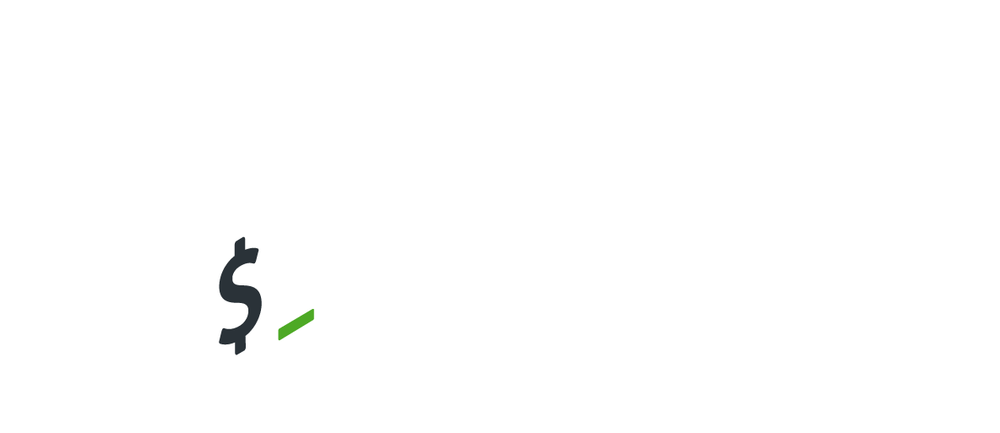

# Welcome | Course Introduction

<figure><figcaption></figcaption></figure>

<figure><figcaption></figcaption></figure>

\---


**There are no particular prerequisites for this course. You just need a passion to learn programming. If&#x20;**_**you are a beginner, don’t worry!**_&#x20;


