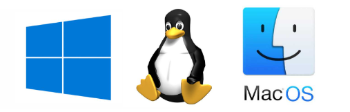

# Operating Systems

<figure><figcaption></figcaption></figure> <figure><figcaption></figcaption></figure> <figure><figcaption></figcaption></figure> <figure><figcaption></figcaption></figure> <figure><figcaption></figcaption></figure> <figure><figcaption></figcaption></figure>

<figure><figcaption></figcaption></figure> <figure><figcaption></figcaption></figure> <figure><figcaption></figcaption></figure>

***

## How the OS Works 

An overview of how the OS allows the interaction of application software with hardware.

Why did we start to study programming by considering the OS? This is because OS features form the basis of an application. So, let’s consider how the OS works.

<figure><figcaption></figcaption></figure>

### OS operation 

The figure on the right side demonstrates the interaction between the OS, an application, and the computer hardware.

**Applications** are programs that solve practical user tasks. Examples include text editors, calculators, and browsers. **Hardware** refers to all electronic and mechanical components of a computer. For example, hardware includes keyboards, monitors, central processors, and video cards.

According to the figure on the right, an application does not directly interact with the hardware. Instead, it works through **system libraries**. The system libraries are part of the OS. There are rules to access the system libraries, and each application should follow them.

## Application Programming Interface 

Learn how the OS acts as an API in a computer.

### API 

The **Application Programming Interface (API)** is the interface the OS provides to an application to interact with system libraries. In general, an API refers to a set of agreements between the interacting components of an information system. These agreements often become a well-known standard. For example, the POSIX standard describes the API for a portable OS. The standard guarantees the compatibility of the OS and applications.

The OS’s kernel and device drivers are part of the OS. They dictate which hardware features the application can access. The **kernel** of the OS provides a mechanism for managing access to the hard drive. This mechanism is called a **file system**. Similarly, the OS manages access to all peripheral and internal devices of the computer. Besides the kernel, there are special programs called **device drivers** that help the OS to control devices.

When the application interacts with system libraries, the libraries request the capabilities of the kernel and drivers. If we need a hardware feature and the OS does not support it, we cannot use it.

When the application accesses the system library, it calls a library’s function. A function is a program fragment or an independent block of code that performs a certain task. We can imagine the API as a list of all available functions that the application can call. Besides this, the API describes the following aspects of the interaction between the OS and applications:

1. What action the OS performs when the application calls a specific system function
2. What data the function receives as input
3. What data the function returns as output?

Both the OS and application should follow the API agreements. This guarantees the compatibility of their current versions and future modifications. Such compatibility is impossible without a well-documented and standardized interface.

#### Limitations of bare-metal software 

We have discovered that some applications work without an OS. They are called bare-metal software. This approach works well in some cases. However, the OS provides ready-made solutions for interaction with the computer’s hardware.

Without an OS, developers must take responsibility to manage hardware. It requires significant effort. Let’s imagine the variety of devices of a modern computer. The application should support all popular models of each device (for example, different video cards). Without such support, the application won’t work for all users.

### OS features via the API 

Let’s now consider the features the OS provides via the API. We can treat the computer’s hardware as resources. The application uses these resources to perform calculations. The API reflects the list of hardware features that the program can use. Also, the API dictates the order of interaction between several applications and the hardware.

Here is an example. Two programs cannot simultaneously write data to the same area of the hard disk. There are two reasons for this:

1. A single magnetic head records data on the hard disk. The head can only do one task at a time.
2. One program can overwrite the data of another program in the same memory area. This leads to the loss of data.

\
Therefore, we should place all requests to write data on the disk in a queue. Then, each request is performed separately, and the OS takes care of them.

\-----x-----x-----x-----x-----x-----x------x-----x-----x-----x-----x-----x-----x-----x-----x-----x-----
